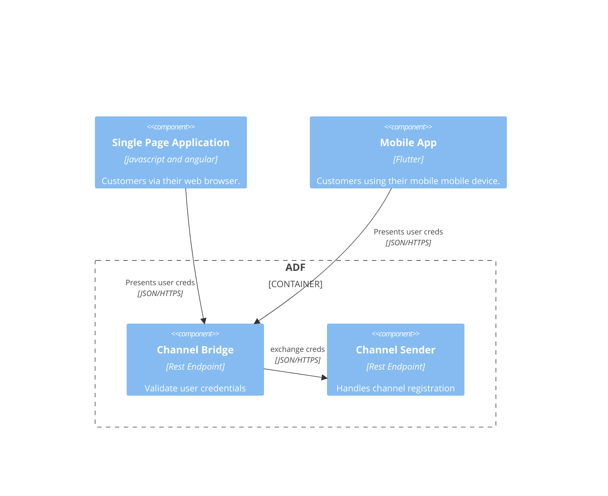
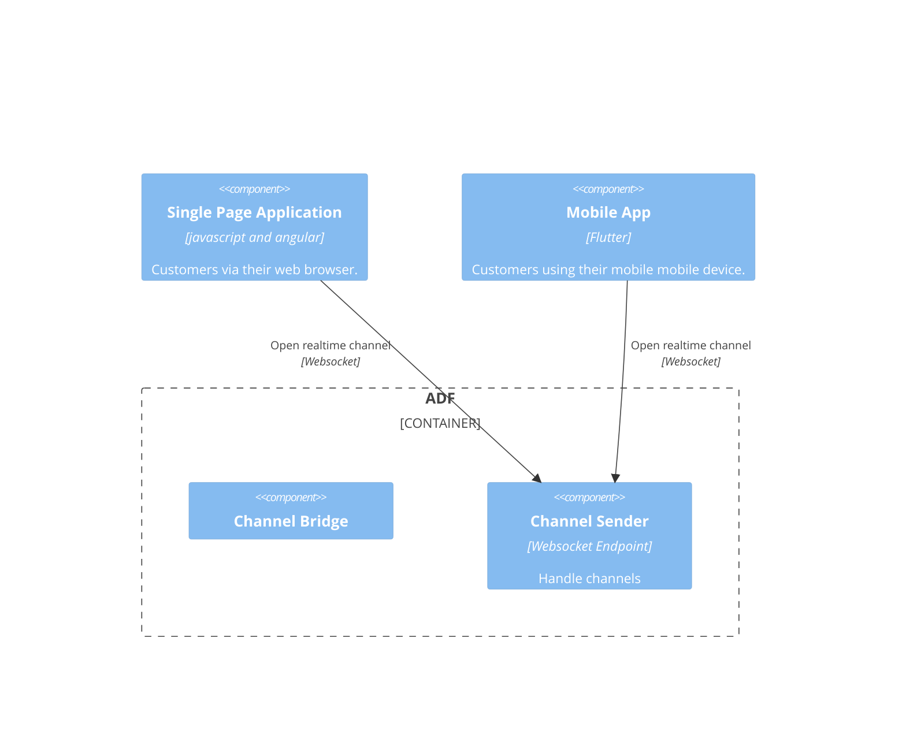
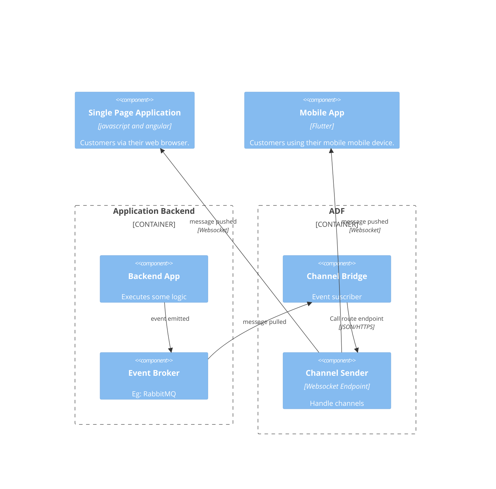

# Channel Bridge

Distributed Elixir Cluster implementation of a async messages router.

- [How it works](#how-it-works)
- [Install](#install)
- [Configuration](#configuration)
- [Run](#run)

## How it works

Channel Bridge adds a layer to Sender providing authorization functionality. 



Once the channel credentials have been obtained:



Message Flow:




## Install

### Requirements

- Elixir >= 1.15
- Mix

### Compile

```elixir
mix deps.get
mix compile
```

## Configuration

Open and edit the `config.yaml` file to set up configurations.

## Run

In the shell:

```bash
$ iex -S mix
```

or to run several instances locally

```bash
$ MIX_ENV=<CONFIG-FILE-NAME> iex --erl "-name async-node1@127.0.0.1" -S mix

```

### Connect nodes in erlang cluster in k8s

ADF Bridge incorporate `libcluster` dependency in order to facilitate the automatic configuration of erlang clusters in kubernetes.

In folder [deploy_samples\k8s](./deploy_samples/k8s/README.md) we have included manifests to deploy ADF sender on kubernetes (and also if istio is present), using 3 of the strategies supported by `libcluster`.
