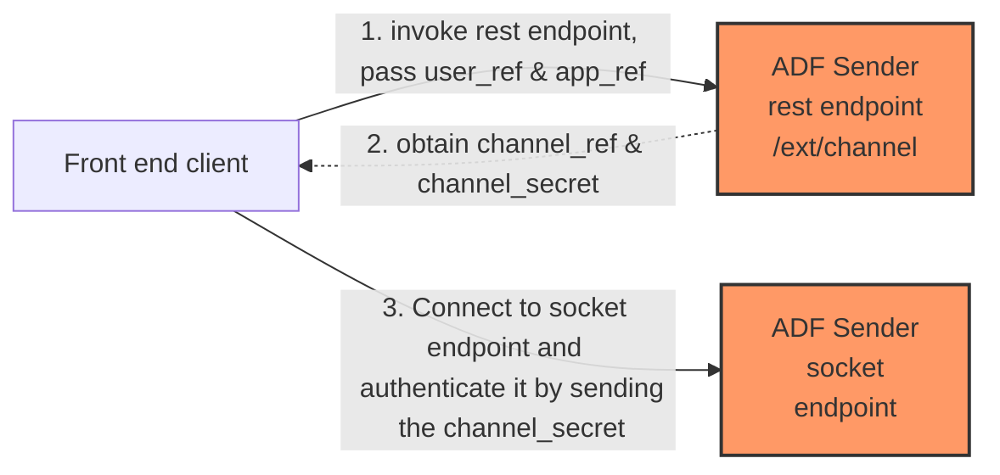
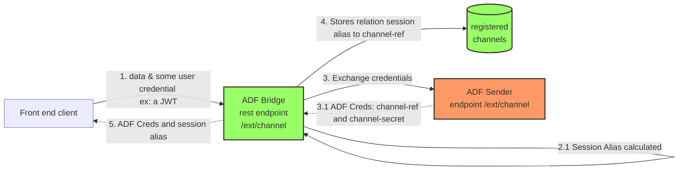
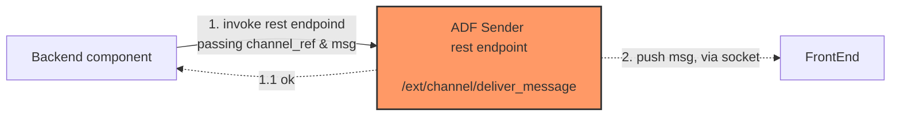
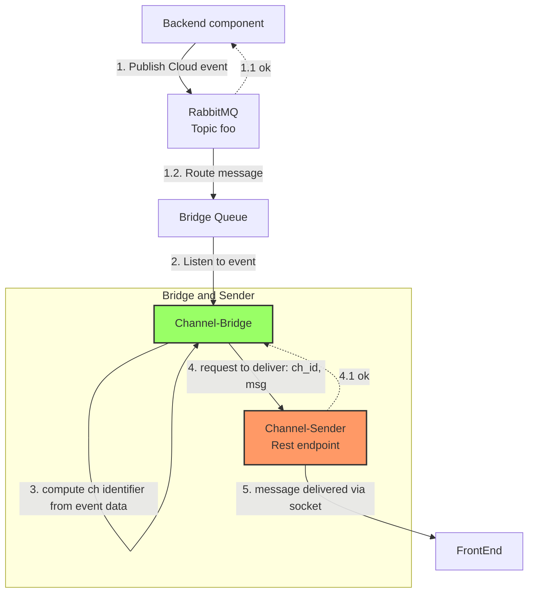

# Async Dataflow Channel Bridge/Router

## Contents

- [What is ADF Channel Bridge](#what-is-adf-channel-bridge)
- [How to Run](#how-to-run)
- [Usage Scenarios](#usage-scenarios)
- [Features](#features)
- [Configuration](#configuration-index)

## What is ADF Channel Bridge

This module serves two functions:

- Like a gate keeper for [Async Dataflow Channel Sender](https://github.com/bancolombia/async-dataflow/tree/master/channel-sender) rest services.

  - **ADF Channel Bridge** serves as a secured mechanism for registering channels with **ADF Channel Sender**, exposing a rest endpont. This endpoint should be secured with the apropriate authentication mechanism. For example exposing such endpoint via a secured gateway and checking for a valid bearer token. Of course you can also implement your own auth flows.
  - As a result of a successful auth process, **ADF Channel Bridge** calculates (with data present in the request headers, or the bearer token claims(if present), or body) an unique tuple of `user_ref` / `app_ref` to forward the channel registration to **ADF channel sender**. You can configure what data should ADF Bridge use to build such tuple.
  - Obtain the credentials `channel_ref` / `channel_secret` provided by **ADF channel sender**, and link them with an user session identifier in an in-memory repository.
  - Return credentials to caller. Caller uses this credentials to physically open the socket with **ADF channel sender**, using any of the available clients ([Javascript](https://github.com/bancolombia/async-dataflow/tree/master/clients/client-js), [Dart](https://github.com/bancolombia/async-dataflow/tree/master/clients/client-dart)).

- Also can serve like a Router, listening for events in the event bus (RabbitMQ) and:

  - Inspect each event looking for certain data (Configured JSON paths), trying to identify if such event should be relayed via ADF Sender as an asynchronous response.
  - Obtains the user provided session identifier in such event.
  - Determines if there's a channel registered for such session-id, and If such a channel exists, then delivers the cloud event to the front end client via **ADF channel sender** appropiate rest endpoint.

**IMPORTANT**: What AsyncDataflow Channel Bridge doesn't do:

- Create or Manage TCP connections with clients.
- Garantee client connection or reconnection of TCP sockets

Those are resposability of [Async Dataflow Channel Sender](https://github.com/bancolombia/async-dataflow/tree/master/channel-sender) and/or avaliable clients.


## How to run

### Requirements

- Elixir >= 1.10
- Mix

Infraestructure:
- You need a running instance of `Async DataFlow Channel Sender`.
- Also an instance of RabbitMQ with a specific exchange, binding name and queue.
- All of those configured in the `config.yaml` file.

### Compile
```bash
mix deps.get
mix compile
```

TODO: _complete documentation of configuration properties._

### Run
In the shell:
```bash
iex -S mix 
```
or
```bash
 MIX_ENV=<CONFIG-FILE-NAME> iex --erl "-name bridge-node<NUMBER>@127.0.0.1" -S mix 
 ```
 ### Connect nodes
Can connect the nodes with a self-discovery strategy as a central register or broadcast, you can also connect the nodes manually with the following task. **this task is useful in development environment.**
```elixir
iex1> Node.connect(:"node-name@ip")
 ```
 and verify with:
 ```elixir
 iex1> Node.list()
 ```

## Usage Scenarios


Lets recall how to interact with channel-sender, from the front end perspective:



A client call sender's `/ext/channel` rest endpoint to obtain a channel reference and a secret, that are needed to open the socket channel and authenticate it.

### A. Use case for channel-bridge: Security Layer

You can use channel bridge to serve as a security layer, to allow only clients with certain access privileges to invoke senders rest endpoint. For example, exchanging an users JWT access token, to channel-sender credentials.



1. Front end makes a call to channel-bridge rest endpoint an passes all necessary data.

2. Channel-bridge can perform some validation. Eg. Validating a JWT token.

   - Also you can extend channel-bridge to perform any validations needed prior to register a channel.

3. Channel-bridge, can calculate the channel identifier (or session alias). This is an importan step. This alias should be a data naturally existent in the message exchanges brtween front end and back end. This way a developer no longer needs to handle a channel-ref parameter. 

   - You can tell channel-bridge via configuration, how to extract the channel identifier within the message payload or decoded token payload or headers, in order to construct an unique identifier to the user. 
   - The Routing use case explain how this channel identifier is used.

4. With this data, channel-bridge calls channel-sender to register the new channel and obtain credentials.

5. Channel-bridge stores the relation between the channe identifier, or session identifier with tha channel id given by channel-sender.

6. Give this data to the front end.

### B. Use case for channel-bridge: Route messages asynchronously

With channel-sender alone, you call `/ext/channel/deliver_message` rest endpoint to request message delivery.



But, the requester needs to know the exact `channel_reference` of the channel opened by the front end. This can be dificult if you have deployed several microservices that are (and should be) unaware of the existence of socket connections between channel-sender and the front-end.


### Route a message



1. Channel-bridge can participate in a publish-subscribe model. So, routing a message is done by publishing a message to a topic in an event bus (RabbitMQ), usually by any backend component whithin the domain.
   There must be a queue dedicated to channel-bridge and a routing defined:
   ```
   Domain Topic -> Routing key -> ADF bridge's Queue
   ```

   - _The topic name, queue name and routing key are part of the channel bridge configuration._

   - The message is expected to be consistent with a [Cloud event](https://github.com/cloudevents/spec/blob/v1.0.2/cloudevents/spec.md). Example:

      ```json
      {
        "data": {
          "msg": "Hello World, Much Wow!"
        },
        "dataContentType": "application/json",
        "id": "A234-1234-1234",
        "source": "https://organization.com/cloudevents/operation",
        "specVersion": "1.0",
        "time": "2018-04-05T17:31:00Z",
        "subject": "foo",
        "type": "bussines.event.transaction.completed"
      }
      ```

2. Channel-bridge listen to those published events. 

3. Each event payload is inspected and a channel identifier (or session alias) extracted, acording to configuration property `bridge.cloud_event_channel_identifier`. Then channel-bridge determines if there is previous channel registration.

   The idea is to use natural channel-identifiers (users name, user id, etc), in order to avoid handling an additional reference back and fort for routing messages.

4. If a channel registration was made for such channel, then channel-bridge calls channel-sender rest endpoint to request message to be routed for that channel.

5. Front end client receives message.

## Features

### Pluggable Authentication

You can define your own auth process by implementing the `@behaviour` `ChannelBridgeEx.Core.Auth.AuthProvider`, and then define your module in configuration yaml, property `bridge.authenticator`.

Out of the box, channel-sender provides 3 concrete implementations:

- `ChannelBridgeEx.Core.Auth.PassthroughAuth`. This is default and performs no authentication at all. Just a pass through.

- `ChannelBridgeEx.Core.Auth.JwtAuthenticator`. This one parses and validates a JWT Token with an asymetric key. And produces the decoded JWT as part of the request. 

   - Details of this process is implemented in the module `apps\jwt_support`.

- `ChannelBridgeEx.Core.Auth.JwtParseOnly`. This one just decode the JWT Token (no signature validation is peformed), produces the decoded JWT as part of the request.

### CloudEvent message mutation

Channel-bridge is subscribed to cloudEvents in the configured RabbitMQ queue, and upon receiving an event, you can perform any mutation needed on the message prior to request channel-sender to route it. All you have to do is implement the `@behaviour` `ChannelBridgeEx.Core.CloudEvent.Mutator` and define your transformation(s), and configure the mutator in the configuration yaml, property `bridge.mutator`.

## Adapters

Plugable modules to abstract some functionality and provide a easy mechanism to extend or provide connectors

- JWT Suport. 

## Configuration Index

Channel-bridge uses a `config.yaml` to define all configurations.

|Attribute|Example|Description|
|---|---|---|
|bridge.rest_port| 8083 | Port for channel-bridge rest endpoints |
|bridge.request_app_identifier.strategy|  | `fixed` or `lookup` |
|bridge.request_app_identifier.field|  | Determines how to calculate an **application reference** to pass to channel-sender, from data present in the request. If `bridge.request_app_identifier.strategy=fixed` is used, app identifier will use this fixed value. If `bridge.request_app_identifier.strategy=lookup` is used, then this field can declare an expression like `$.req_headers['some-header-name']`. Values can be extracted from `$.req_headers`, `$.req_params`, `$.body` or `$.token_claims` |
|bridge.request_user_identifier| List | Determines hoy to calculate an **user reference** from data present in the request. This field can declare a yaml list of expressions like `$.req_headers['some-header-name']`. Values can be extracted from `$.req_headers`, `$.req_params`, `$.body` or `$.token_claims`. Values will be concatenated using hyphen (-). |
|bridge.request_channel_identifier| List | Determines how to calculate a channel identifier or (session identifier) from data present in the request. A yaml list of expressions like `$.req_headers['some-header-name']`. Values can be extracted from `$.req_headers`, `$.req_params`, `$.body` or `$.token_claims`. Values will be concatenated using hyphen (-). |
|bridge.cloud_event_channel_identifier| List | Determines how to calculate a channel identifier or (session identifier) from data present in the cloudevent. A yaml list of json expressions to extract the channel identifier from the event data. This must produce the same value produced by `bridge.request_channel_identifier` property. Values will be concatenated using hyphen (-). |
|bridge.cloud_event_app_identifier.strategy|  | `fixed` or `lookup` |
|bridge.cloud_event_app_identifier.field|  | Determines how to calculate an **application reference** to pass to channel-sender, from data present in the cloudevent. If `bridge.cloud_event_app_identifier.strategy=fixed` is used, app identifier will use this fixed value. If `bridge.cloud_event_app_identifier.strategy=lookup` is used, then this field can declare a json expression. |
|bridge.event_bus.rabbitmq.bindings.name| | Topic name in RabbitMQ where a subscription is going to be created with a routing key to the ADF queue|
|bridge.event_bus.rabbitmq.bindings.routing_key | | The routing key to create the subscription with  |
|bridge.event_bus.rabbitmq.queue | | The queue name where channel-bridge listens to |
|bridge.event_bus.rabbitmq.username | | username to conecto to RabbitMq |
|bridge.event_bus.rabbitmq.password | | password to conecto to RabbitMq |
|bridge.event_bus.rabbitmq.hostname | | RabbitMq host |
|bridge.event_bus.rabbitmq.port | | RabbitMq port |
|bridge.event_bus.rabbitmq.virtualhost | | RabbitMq virtualhost |
|bridge.event_bus.rabbitmq.virtualhost | false | used to indicate if connection with RabbitMQ shoud be TLS/SSL secured. |
|bridge.sender.rest_endpoint | | Channel sender rest endpoint. Ex. http://somehost:8081 |

## Health Endpoints

`/liveness` and `/readiness` endpoints are available to use as probes on K8S deployments.

## Metrics endpoint

A `/metrics` endpoint its available, to fetch diferent metrics and export them to other tools, for example, **Prometheus**.

### Available metrics

Multiple erlang VM and other tools metrics are available at such endpoint,  including our own defined metrics:

|Metric|Type|Description|
|---|---|---|
|adfcb_broadway_msg_count|Counter|count of messages received from rabbitmq by broadway (the tool for streaming messages).|
|adfcb_broadway_err_count|Counter|count of errors receiving messages from broadway|
|adfcb_cloudevent_parse_count|Counter|counter for messages succesfully parsed as CloudEvents.|
|adfcb_cloudevent_parse_fail_count|Counter|counter for CloudEvent Messages Failed to parse|
|adfcb_cloudevent_failed_mutations_count|Counter|Counter for errors performing mutations to CloudEvent Messages, for example, homologating error codes.|
|adfcb_channel_alias_missing|Counter|Counter for messages not having an alias. So delivery is not possible.|
|adfcb_channel_noproc_count|Counter|Counter for errors when looking for a channel process linked to an alias, but the process does not exist. In this case delivery of a message is also not possible.|
|adfcb_sender_request_channel_count|Counter|Counter for channel registration requests sent to ADF sender.|
|adfcb_sender_request_channel_fail_count|Counter|Counter for failures requesting channel registration to ADF sender.|
|adfcb_sender_delivery_count|Counter|Counter for message routing requests sent to ADF sender.|
|adfcb_sender_delivery_fail_count|Counter|Counter for failures requesting delivering a message to ADF sender. In this case the request for delivering a message was made to ADF sender, but ADF sender was not available o returned an error response.|
|adfcb_plug_request_count|Counter|Counter of rest requests received to any of the Bridge endpoints|
