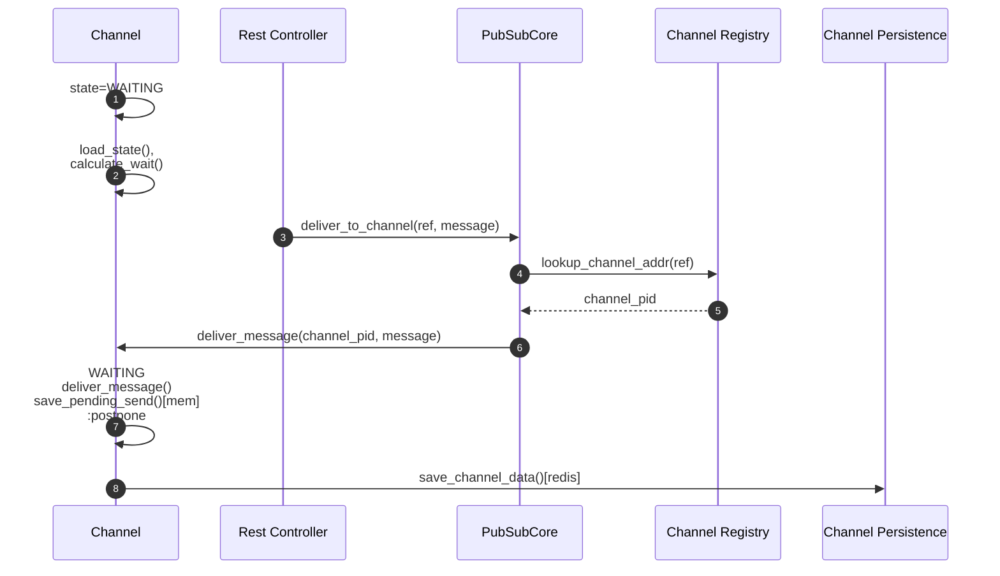

# Async Dataflow Channel Functions

## Receivig messages while on state WAITING

```mermaid
sequenceDiagram
    autonumber
    Channel->>Channel: state=WAITING
    Channel->>Channel: load_state(),<br>calculate_wait()
    Rest Controller->>PubSubCore: deliver_to_channel(ref, message)
    PubSubCore->>Channel Registry: lookup_channel_addr(ref)
    Channel Registry-->>PubSubCore: channel_pid
    PubSubCore->>Channel: deliver_message(channel_pid, message)
    Channel->>Channel: WAITING<br>deliver_message()<br>save_pending_send()[mem]<br>:postpone
    Channel->>Channel Persistence: save_channel_data()[redis]

```

## Receivig Connected signal from Socket