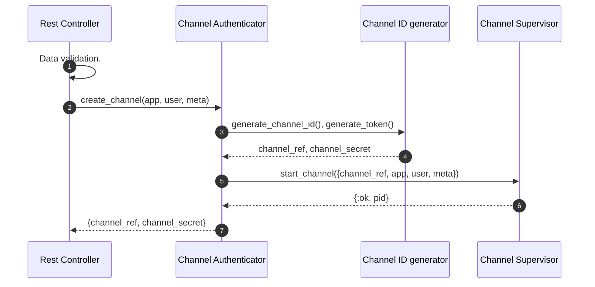

# Async Dataflow Channel Registration

```mermaid
    sequenceDiagram
        autonumber
        Rest Controller->>Rest Controller: Data validation.
        Rest Controller->>Channel Authenticator: create_channel(app, user, meta)
        Channel Authenticator->>Channel ID generator: generate_channel_id(), generate_token()
        Channel ID generator-->>Channel Authenticator: channel_ref, channel_secret
        Channel Authenticator->>Channel Supervisor: start_channel({channel_ref, app, user, meta})
        Channel Supervisor-->>Channel Authenticator: {:ok, pid}
        Channel Authenticator-->>Rest Controller: {channel_ref, channel_secret}
```

