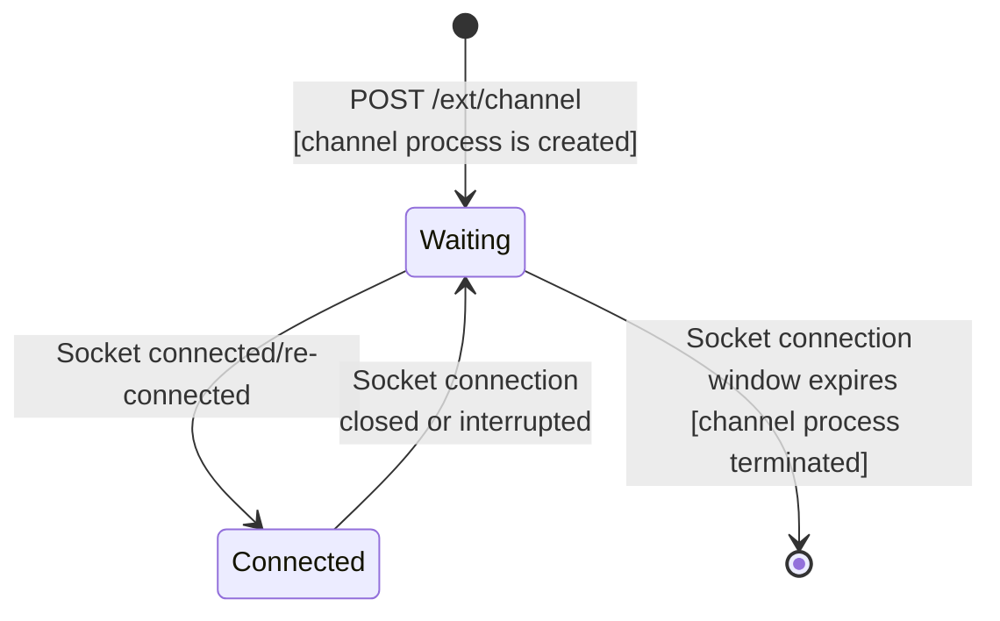

# Async Dataflow Channel Sender State Machine

## Implementation of StateMachineGen

ADF channel sender uses the `StateMachineGen` to implement a state machine. See `ChannelSenderEx.Core.Channel` 
module for the implementation.

## State machine description

### Steps

1. When the client (web or mobile) calls the registration endpoint `POST /ext/channel` a new channel process is started
   with its initial state `waiting`.
2. When the client (web or mobile) opens a socket connection with the server, internally the process state change to 
   `connected`.
3. If the connection between client and server is interrupted, the process returns to `waiting` state.

   The `waiting` state has a timer control, which expects a socket connection (or re-connection) within the time window
   defined by the `channel_shutdown_socket_disconnect` parameter in the configuration yaml (unit time is seconds) in order to return to the `connected` state.
   
   If socket the disconnection was clean (the client requested to close), then the process uses the time defined in te
   configuration `channel_shutdown_socket_disconnect.on_clean_close` (default 30 seconds). If this parameter is zero (0)
   the process is terminated inmediatlly.

   If socket disconection wasn't clean (the client and server lost connection), then the process uses the time defined in te
   configuration `channel_shutdown_socket_disconnect.on_disconnection` (default 300 seconds). If this parameter is zero (0)
   the process is terminated inmediatlly.