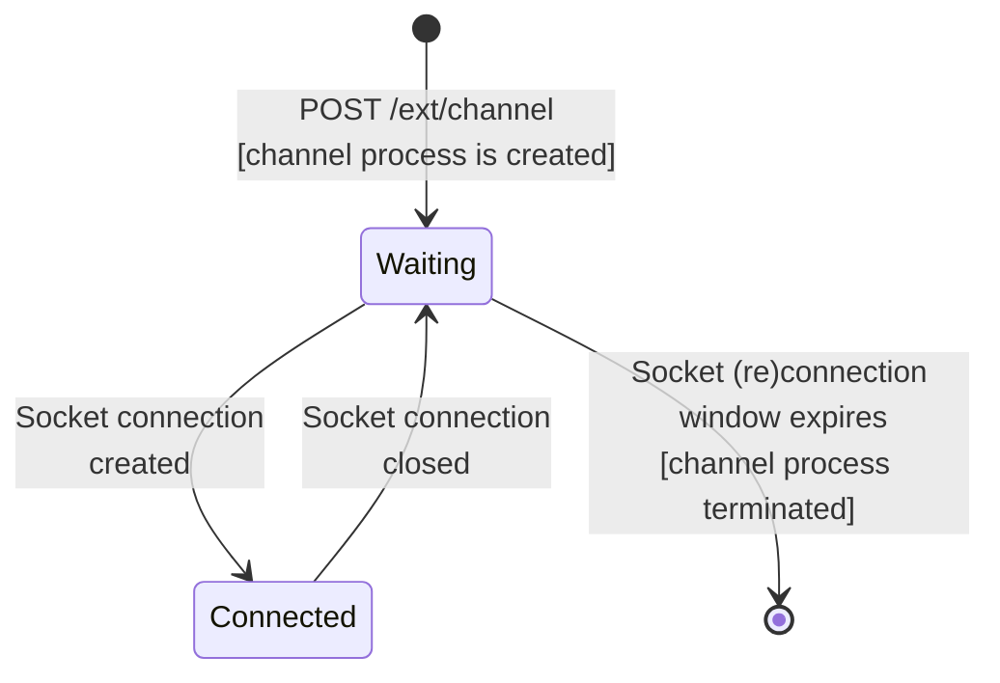

# Async Dataflow Channel Sender State Machine

## Implementation of StateMachineGen

ADF channel sender uses the `StateMachineGen` to implement a state machine. See `ChannelSenderEx.Core.Channel` 
module for the implementation.

## State machine description

### Steps

1. When the client (web or mobile) calls the registration endpoint `POST /ext/channel` a new channel process is started
   with its initial state **waiting**.
2. When the client (web or mobile) opens a socket connection with the server, internally the process state change to 
   **connected**.
3. If the connection between client and server is interrupted, the process returns to `waiting` state.
   The `waiting` state has a timer control, which expects a socket connection (or re-connection) within the time window
   defined by the `:max_age` parameter in the configuration (unit time is seconds). If no socket connection is made, 
   within this window the process is stopped.