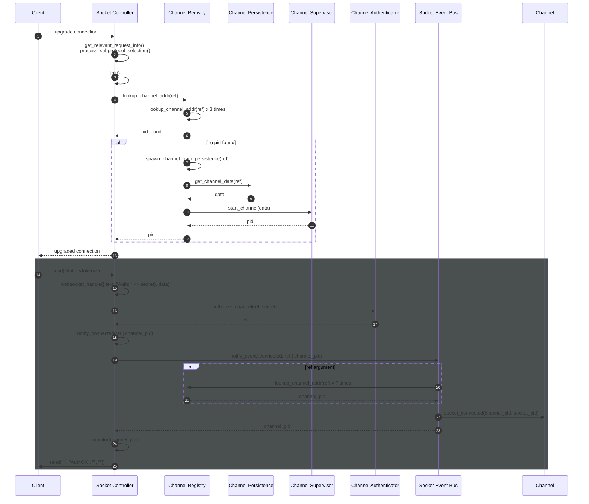

# Socket connection and initialization process

```mermaid
    sequenceDiagram
        autonumber
        Client->>Socket Controller: upgrade connection
        Socket Controller->>Socket Controller: get_relevant_request_info(), <br>process_subprotocol_selection()
        Socket Controller->>Socket Controller: init()
        Socket Controller->>Channel Registry: lookup_channel_addr(ref)
        Channel Registry->>Channel Registry: lookup_channel_addr(ref) x 3 times
        Channel Registry-->>Socket Controller: pid found
        alt no pid found
        Channel Registry->>Channel Registry: spawn_channel_from_persistence(ref)
        Channel Registry->>Channel Persistence: get_channel_data(ref)
        Channel Persistence-->>Channel Registry: data
        Channel Registry->>Channel Supervisor: start_channel(data)
        Channel Supervisor-->>Channel Registry: pid
        Channel Registry-->>Socket Controller: pid
        end
        Socket Controller-->>Client: upgraded connection
        rect rgb(74, 80, 80)
        Client->>Socket Controller: send("Auth::<token>")
        Socket Controller->>Socket Controller: websocket_handle({:text, "Auth::" <> secret}, data)
        Socket Controller->>Channel Authenticator: authorize_channel(ref, secret)
        Channel Authenticator-->>Socket Controller: :ok
        Socket Controller->>Socket Controller: notify_connected(ref | channel_pid)
        Socket Controller->>Socket Event Bus: notify_event(:connected, ref | channel_pid)
        alt ref argument
        Socket Event Bus->>Channel Registry: lookup_channel_addr(ref) x 7 times
        Channel Registry-->>Socket Event Bus: channel_pid  
        end
        Socket Event Bus->>Channel: socket_connected(channel_pid, socket_pid)
        Socket Event Bus-->>Socket Controller: channel_pid
        Socket Controller->>Socket Controller: monitor(channel_pid)
        Socket Controller->>Client: send(["", "AuthOK", "", ""])
        end
```