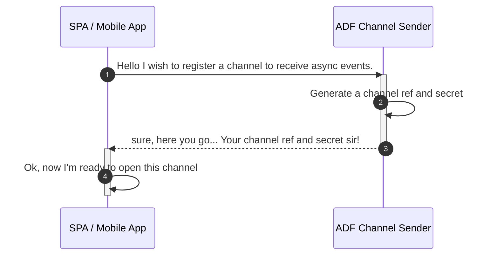
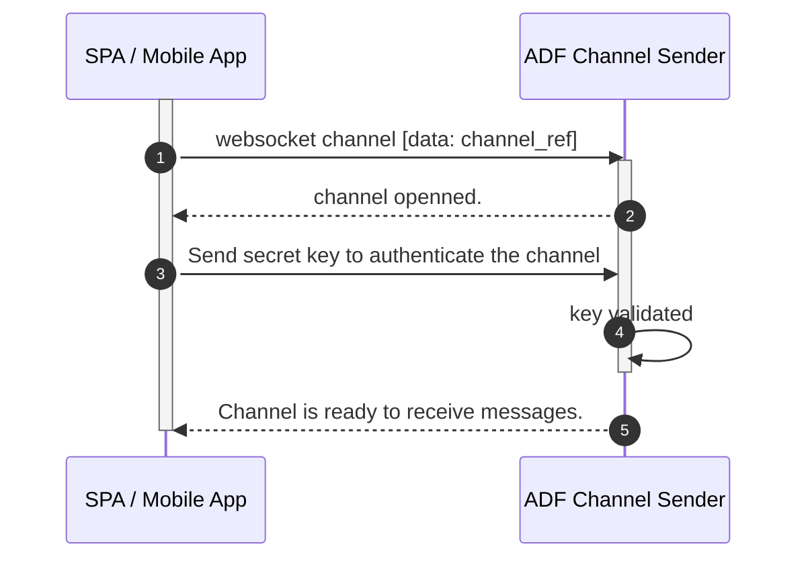
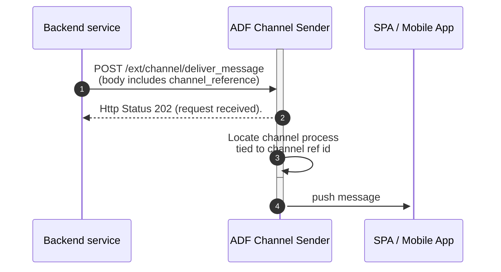

# Channel Flow

## 1. Register a channel

This is a flow to consume the rest endpoint to register a channel and obtain a tuple consisting of:

- channel reference id
- channel secret key

## 2. Open a connection to the channel

This is where actually a channel is opened by the client (SPA or Mobile App) to start receiving events.

## 3. Send messages to Front End

This flow allows your backend services or applications to deliver messages to your front end app.

Flows (1) and (2) are supported by the ADF existent clients:

- [Javascript](https://github.com/bancolombia/async-dataflow/tree/master/clients/client-js)
- [Dart](https://github.com/bancolombia/async-dataflow/tree/master/clients/client-dart)

Flow (3) doesn't have a client implementation, but its fairly simple to implement in any language since given it's a 
rest endpoint that receives a pre-defined json content, which includes the channel reference id and the payload 
to be delivered to the front end. See the [API Documentation](#api-documentation) for more details.