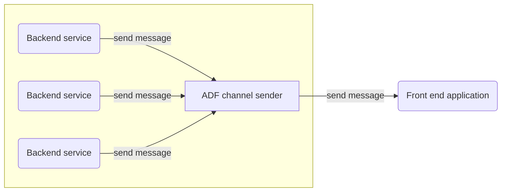

# Channel Sender

Distributed Elixir Cluster implementation of real time with websockets and notifications channels.

This service is part of the Async Dataflow project, which is a set of tools to facilitate the implementation 
of real-time applications.

Channel sender main purpose is to allow backend services to send messages via a real time channel (websocket) to your 
front end application(s) (web or mobile). Enabling you to implement real time notifications, updates, etc.

