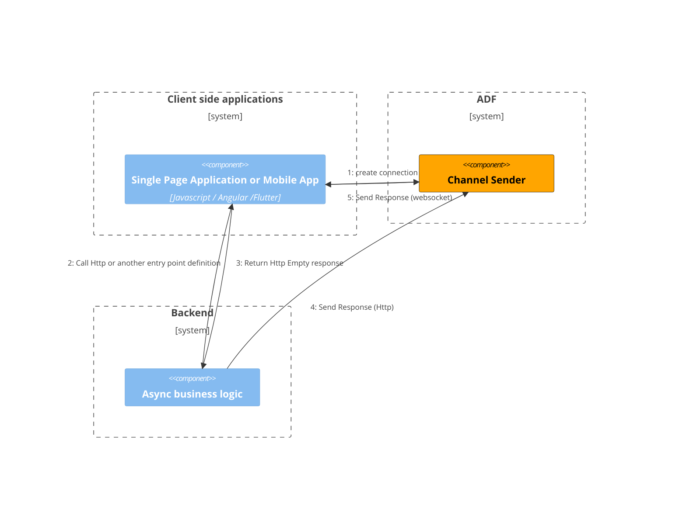
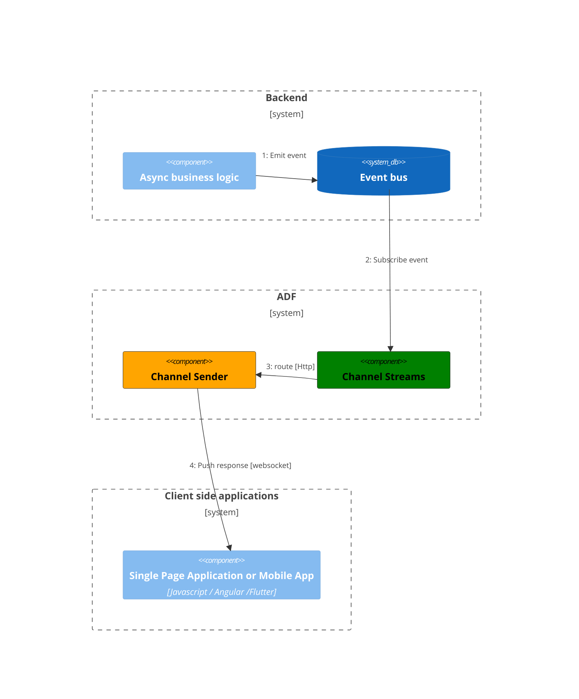

# Async DataFlow

The Async DataFlow component aims to deliver asynchronous responses in real time to client applications, thus enabling end-to-end asynchronois flows without losing the ability to respond in real time or eventually, send data to client applications as a result of asynchronous operations and oriented to `messages / commands / events` on the platform.

## [Channel Sender](/async-dataflow/docs/channel-sender)
Distributed Elixir Cluster implementation of real time with websockets and notifications channels.

## [Channel Streams](/async-dataflow/docs/channel-streams)
Distributed Elixir Cluster implementation of a async messages router.

## Clients

### [Client JS](/async-dataflow/docs/client-js)
Javascript library for async data flow implementation for browsers.
### [Client Dart](/async-dataflow/docs/client-dart)
Dart library for async data flow implementation for flutter applications.
### [Elixir Client](/async-dataflow/docs/client-elixir)
Elixir library for async data flow implementation for elixir applications.

## [Examples](/async-dataflow/docs/examples)
The purpose of this project is to help the community to understand more the the async data flow component to implement in full asyncio solutions.
